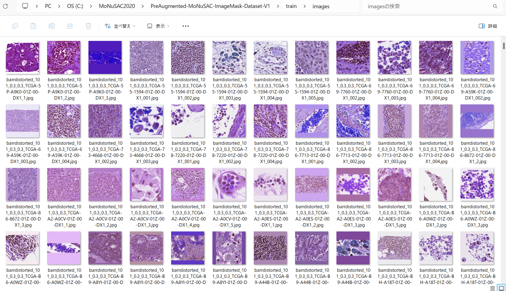

<h2>ImageMask-Dataset-MoNuSAC-2020</h3>
This is 512x512 JPEG PreAugmented MoNuSAC 2020 ImageMaskDatatset for Imae Segmentation. 

The original dataset used here has been take from the following web-site. 

<a href="https://monusac-2020.grand-challenge.org/Data/">Challenges MoNuSAC 2020 Data</a>
 
 
<b>Download PreAugmented-MoNuSAC-Imag</b> 
You can down load our dataset created here from the google drive 
<a href="https://drive.google.com/file/d/1sMmUW6Gqm9hBNdmIHJ60qhgj14n_TPZg/view?usp=sharing">PreAugmented-MoNuSAC-ImageMask-Dataset-V1.zip</a>. 

<h3>1. Dataset Citatioin</h3>
The orginal dataset use here has been taken
<a href="https://monusac-2020.grand-challenge.org/Data/"
<b>Challenges/MoNuSAC 2020/Data</b></a> 
 
<b>Data</b> 
H&E staining of human tissue sections is a routine and most common protocol used by pathologists 
to enhance the contrast of tissue sections for tumor assessment (grading, staging, etc.) at multiple microscopic resolutions. Hence, we will provide the annotated dataset of H&E stained digitized tissue images of several patients acquired at multiple hospitals using one of the most common 40x scanner magnification. The annotations will be done with the help of expert pathologists. 
 
 
<b>License</b> 
The challenge data is released under the creative commons license (CC BY-NC-SA 4.0).
 

<h3>2. Download Training and Testing dataset</h3>
If you would like to create your own dataset, please download Trainign ad Test dataset from the following link. 
<a href="https://drive.google.com/file/d/1lxMZaAPSpEHLSxGA9KKMt_r-4S8dwLhq/view">MoNuSAC_images_and_annotations.zip</a>  
<a href="https://drive.google.com/file/d/1G54vsOdxWY1hG7dzmkeK3r0xz9s-heyQ/view?usp=sharing">MoNuSAC Testing Data and Annotations.zip</a>  

Training and Testing dataset contains many svs and tif image files, and xml anntotation files as shown below.  

<pre>
./MoNuSAC_images_and_annotation
├─TCGA-5P-A9K0-01Z-00-DX1
│  ├─TCGA-5P-A9K0-01Z-00-DX1_1.svs
│  ├─TCGA-5P-A9K0-01Z-00-DX1_1.tif
│  ├─TCGA-5P-A9K0-01Z-00-DX1_1.xml
│  ├─TCGA-5P-A9K0-01Z-00-DX1_2.svs
│  ├─TCGA-5P-A9K0-01Z-00-DX1_2.tif
│  └─TCGA-5P-A9K0-01Z-00-DX1_2.xml
├─TCGA-55-1594-01Z-00-DX1

...

</pre>

<pre>
./MoNuSAC Testing Data and Annotations
├─TCGA-2Z-A9JG-01Z-00-DX1
│  ├─TCGA-2Z-A9JG-01Z-00-DX1_1.svs
│  ├─TCGA-2Z-A9JG-01Z-00-DX1_1.tif
│  ├─TCGA-2Z-A9JG-01Z-00-DX1_1.xml
│  ├─TCGA-2Z-A9JG-01Z-00-DX1_2.svs
│  ├─TCGA-2Z-A9JG-01Z-00-DX1_2.tif
│  └─TCGA-2Z-A9JG-01Z-00-DX1_2.xml
├─TCGA-2Z-A9JN-01Z-00-DX1

...

</pre>

<h3>3. Generate ImageMask master</h3>
 
Please run the following command for Python script <a href="./ImageMaskDatasetGenerator.py">ImageMaskDatasetGenerator.py</a> 
<pre>
>python ImageMaskDatasetGenerator,py True
</pre>.
This command generate <b>PreAugmented-MoNuSAC-master</b> from tif and xml files in MoNuSAC_images_and_annotation dataset,
and <b>MoNuSAC-mini-test</b>
from MoNuSAC Testing Data and Annotations. 

This script generates 512x512 resized JPEG image and colorized mask files by using some offline augmentation methods in the script 
from the training dataset, and non-resized image and colorized mask files from the testing dataset.
<pre>
./PreAugmented-MoNuSAC-master
├─images
└─masks
</pre>
<pre>
./MoNuSAC-mini-test
├─images
└─masks
</pre>

We used the following BGR colors for the 4 categories annotations to create colorized masks.  

<pre>
colormap = {'Macrophage':(255, 0, 0), 
            'Epithelial':(0, 255, 0), 
            'Neutrophil':(0, 0, 255), 
            'Lymphocyte':(0, 255, 255)}

</pre>
<b>Attribute name in annotation 
 
 
<b>Vertex in annotation 
 
 
 
<h3>4. Split master </h3>
Please run the following command for Python script <a href="./split_master.py">split_mastr</a>. 

<pre>
>python split_master.py
</pre>

This command generates PreAugmented-MoNuSAC-ImageMask-Dataset-V1 dataset. 
<pre>
./ PreAugmented-MoNuSAC-ImageMask-Dataset-V1
├─test
│  ├─images
│  └─masks
├─train
│  ├─images
│  └─masks
└─valid
    ├─images
    └─masks
</pre>

<b>Train images sample</b> 
 
 
<b>Train masks sample</b> 
 

<b>Dataset Statistics</b> 
 

<b>MoNuSAC-mini-test images sample</b> 
 
 
<b>MoNuSAC-mini-test masks sample</b> 
 

